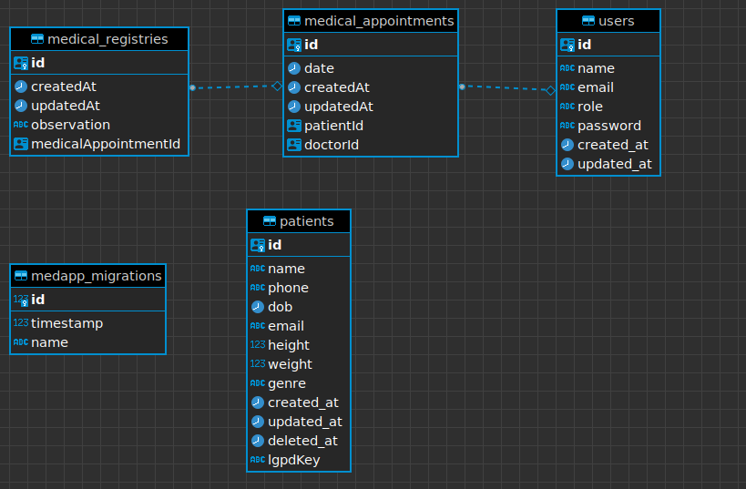

# Agenda de Pacientes

## Requisitos funcionais

### Obrigatórios

- Eu, como médico, quero poder cadastrar um paciente ✅
  - Dados
    - nome
    - telefone
    - email
    - data de nascimento
    - sexo
    - altura
    - peso
- Eu, como médico, quero poder gerenciar o perfil dos pacientes cadastrados.
  - Cadastrar ✅
  - Listar ✅
  - Editar ✅
- Eu, como médico, quero poder gerneciar os agendamentos de consulta para um
  paciente.
  - Cadastrar
  - Listar
  - Alterar
  - Excluir
- Eu, como médico, quero poder anotar uma observação durante a consulta.
- Eu, como médico, quero poder visualizar as anotações das consultas dos pacientes.

### Desejaveis

- Eu como médico, quero que o sistema valide a minha agenda, não deixando eu
  cadastrar mais de um paciente na mesma hora.
- Eu, como médico, quero poder excluir os dados pessoais do paciente por causa das
  novas regras do LGPD, mas mantendo o histórico de consulta por questões de
  contabilidade.

## Requisitos não funcionais

### Obrigatórios

- Deve usar o padrão de API REST (HTTP/JSON) ✅

- Pode ser feito em node.js (javascript ou typescript) ou PHP (laravel) ✅

  - Sistema desenvolvido em NodeJS, com Typescript e o Framework NestJS

- Documentação da interface da API gerada (swagger, open-api, RAML ou postman);

  - Swagger ✅

- Os dados devem ser validados (existência e formatos) na inserção/atualização para
  garantir consistência da base;
- Implementar testes unitários e/ou de integração e/ou documentação de testes (casos
  de teste / script de teste);

### Desejáveis

- Documentação da modelagem do banco de dados (diagrama ER ou de classe);

    

✅ Para o banco de dados pode usar MySQL ou PostgreSQL, podendo optar ou não
pelo uso de ORM;

- Banco de dados utilizado é o PostgreSQL
- ORM Typeorm

✅ Setup de ambiente de desenvolvimento usando docker / docker-compose;

- Hospedar em um ambiente cloud a sua escolha (Heroku, AWS EBS, IBM Cloud, etc)

- Garantir autenticação e/ou autorização (login/logout, token JWT, roles)

- Implementar alguma ferramenta de lint ou qualidade (sonar, code-quality, eslint, etc)

- Deploy automatizado via pipeline (gitlab-ci, bitbucket pipeline, github actions, etc)
